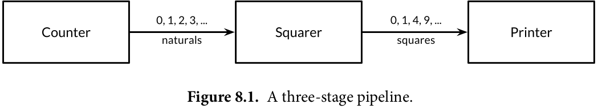
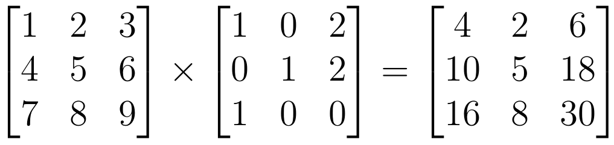
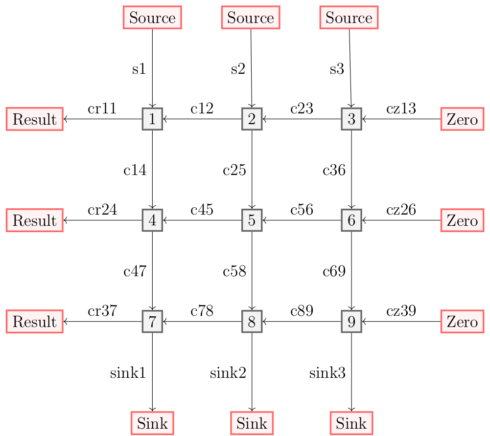

# Uso de canales para multiplicación paralela de matrices

Un ***canal*** conecta un proceso remitente con un proceso receptor. Los canales son ***tipados***, lo que significa que 
debemos declara el tipo de mensajes que pueden ser enviados en el canal. En lo que sigue, suponemos que los canales son síncronos.
En sistemas operativos, los canales son denominados ***pipes***; los cuales permiten construir programas conectando un conjunto ya existente de programas.


Con canales podemos realizar ***pipelined computation***. En este caso, usaremos canales para 
realizar una multiplicación paralela de matrices.

## Brevísimas notas de concurrencia en Go

#### Goroutines

En Go, cada actividad actividad que se ejecuta de manera conrrente es llamada una ***goroutine***. Cuando un programa comienza, hay una sola goroutine que llama a la función ```main``` , de manera que podemos llamarla la   ***main goroutine***. Podemos crear nuevas goroutines con la declaración  ```go```. De forma sintática, una declaración ```go``` es un método o función ordinaria que es precedido por la palabra reservada ```go```.  

#### Canales

Si las goroutines son las actividades de un programa concurrente en Go, los ***channels*** son las conexiones entre estas.  Un canal es un mecanismo de comunicación que permite a una goroutine enviar valores a otra goroutine. Cada canal es un conducto de valores de un tipo particular, denominado el ***elemento tipo*** del canal. El tipo de un canal cuyos elementos tienen tipo ```int``` se escribe ```chan int```.

Para crear un canal, usamos la función ```make```:
```go
ch:=make(chan int) // ch tiene tipo 'chan int'

```
Un canal es una **referencia** a la estructura de datos creada por ```make```. Cuando copiamos un canal o lo pasamos como un argumento a una función, estamos copiando una referencia, de manera que el **caller** y el **calle** refieren a la misma estructura de datos. 

Un canal tiene dos operaciones principales, ***send*** y ***receive***, conocidas colectivamente como ***comunicaciones***. Una declaración send transmite un valor a través del canal de una goroutine a otra goroutine que esté ejecutando una expresión receive. Ambas operaciones son escritas usando el operador  ```<-```. En una decaración send, el operador ```<-``` del canal y del valor operado. En una expresión receive, ```<-``` precede al canal.
Una expresión receive cuyo resultado no es usado es una declaración válida:

```go
ch<- x // Una declaración send
x=<- ch // Una expresión receive en una declaración de asignación
<-ch 	// Una declaración receive, el resultado es descartado
```

Los canales presentan una tercera operación, ***close***, que define una bandera que indica que no se enviarán más valores por el canal. Para cerrar un canal, usamos la función ```close```:
```go
close(ch)
```

Un canal creado con una llamada simple a ```make``` es denomidado como un canal ***unbuffered***, pero ```make``` acepta un segundo argumento, un entero denominado como la ***capacidad*** del canal. Si la capacidad es distinta de cero, ```make``` crea un canan ***buffered**:

```go
ch = make(chan int)// unbuffered channel
ch = make(chan int, 0) // unbuffered channel
ch = make(chan int, 3) // buffered channel with capacity 3
```

#### Pipelines

Los canales pueden ser usados para conectar goroutines de manera que el output de una es el intput de la otra. Esto es llamado un ***pipeline***. El programa que se presenta abajo consiste de tres goroutines conectadas por dos canales, como muestra la siguiente imagen:

 


La primera goroutine, ***counter***, genera los enteros 0,1,2,..., y los envía sobre el canal a la segunda goroutine, ***square***, que recibe cada valor, lo eleva al cuadrado, y envía el resultado sobre otro canal a la tercera goroutine, ***printer***, que recibe los valores y los imprime. 


```go
package main

import "fmt"

func main() {
	naturals := make(chan int)
	squares := make(chan int)
	// Counter
	go func() {
		for x := 0; ; x++ {
			naturals <- x
		}
	}()
	// Squarer
	go func() {
		for {
			x := <-naturals
			squares <- x * x
		}
	}()
	// Printer (in main goroutine)
	for {
		fmt.Println(<-squares)
	}
}

```
Si queremos enviar una cantidad finita de valores  a través del pipeline, es preciso indicarle a la goroutine remitente que se comunique con la goroutine receptora para notificarle que más valores no serán enviados por el canal, para así evitar que permanezca esperando un valor. Lo anterior es realizado ***cerrando*** el canal con la función ```close```.

En el siguiente pipeline, cuando la goroutine counter termina el loop, cierra el canal ```naturals```, provocando que la goroutine squarer finalice su loop y cierre el canal ```squares```. Por último, la goroutine main finaliza su loop y termina el programa.

```go
package main

import "fmt"

func main() {
	naturals := make(chan int)
	squares := make(chan int)
	// Counter
	go func() {
		for x := 0; x < 100; x++ {
			naturals <- x
		}
		close(naturals)
	}()
	// Squarer
	go func() {
		for x := range naturals {
			squares <- x * x
		}
		close(squares)
	}()
	// Printer (in main goroutine)
	for x := range squares {
		fmt.Println(x)
	}


```
#### Unidirectional Channel Types
 
 En la medida que los programas crecen, es natural romper funciones grandes en piezas pequeñas. En los ejemplos anteriores, usamos tres goroutines que se comunican sobre dos canales, los cuales eran variables locales del ```main```.  Naturalmente, el programa se divide en tres funciones:
 
``` go
func counter(out chan int)
func squarer(out, in chan int)
func printer(in chan int)
```

La función ```squarer```, situada en medio del pipeline, toma dos parámetros, el intput del canal y el output del canal. Ambos tienen el mismo tipo, pero sus usos pretendidos son opuestos: ```in``` es sólo para recibir y ```out``` es sólo para enviar. Los nombre ```in``` y ```out``` comunican esta intención, pero a pesar de ello, nada previene que ```squarer``` envíe a ```in``` o reciba de ```out```.

Este acuerdo es típico. Cuando se suministra un canal como parámetro de una función, es casi siempre con la intención que este sea usado exclusivamente ya sea exclusivamente para enviar o para recibir.

Para documentar esta intención y prevenir su mal uso, Go proporciona tipos de canales ***unidireccionales*** que presentan sólo una de las operaciones de envío y recepción. El tipo  ```chan<-int```, un un canal ***send-only*** de ```int```, permite enviar pero no recibir. Por el contrario, el tipo ```<-chan int```, un canal ***receive-only*** de ```int```, permite recibir, pero no enviar.  La violación de este orden es detectado en tiempo de compilación.

Dado que la operación ```close``` asegura que no ocurrirán más envíos en el canal, sólo la goroutine de envío está en posición de llamarla, y por esta razón este es un error de tiempo de compilación al intentar cerrar un canal exclusivo de recepción.

Presentamos el programa nuevamente, incorporando el tipo de canales unidireccionales:

```go
package main

import "fmt"

func counter(out chan<- int) {
	for x := 0; x < 100; x++ {
		out <- x
	}
	close(out)
}
func squarer(out chan<- int, in <-chan int) {
	for v := range in {
		out <- v * v
	}
	close(out)
}
func printer(in <-chan int) {
	for v := range in {
		fmt.Println(v)
	}
}
func main() {
	naturals := make(chan int)
	squares := make(chan int)
	go counter(naturals)
	go squarer(squares, naturals)
	printer(squares)

```

La llamada ```counter(naturals)``` implicitamente convierte ```naturals```, un valor de tipo ```chan int```,  al tipo del parámetro, ```chan<-int```. La llamada a ```printet(squares)```  realiza una conversión implícita similar a ```<-chan int```.  Las conversiones de tipos de canales bidireccionales a unidireccionales son permitidas en cualquier asignación. Sin embargo, no hay vuelta atrás: una vez que tienes un valor de un tipo unidireccional tal como ```chan<-int```, no hay forma de obtener de este un valor de tipo ```chan int``` que refiera a la misma estructura de datos del canal.

#### Multiplicación Paralela de Matrices

Abajo presentamos una multiplicación de matrices:



Podemos expresar este cálculo usando 21 procesadoes, cada uno ejecutando un proceso sencillo. Los canales de un sólo sentido son denitados como flechas. Usaremos direcciones geográficas para denotar los vecinos de cada procesador.

En términos generales, necesitamos n^2 + 4 X n procesadores para una multiplicación de matrices n X n
Cada procesador ejecuta un sólo proceso. Un proceso es asignado a cada elemento de la matriz que premultiplica
y los inicializamos con los valores de sus elementos. El proceso ```Source``` es inicializado con los vectores filas
de la matriz que posmultiplica y los elementos son enviados uno a uno al proceso ```Multiplier``` hacia el sur; ellos
a su vez transmiten los elementos hasta que finalmente son cachados por el proceso ```Sink```. El proceso ```multiplier```
recibe una suma parcial del este, y le suma el resultado de multiplicar su elemento y el valor recibido del norte.
La suma parcial es inicializada por el proceso ```Zero``` y estas finalmente se envían al proceso ```Result``` al este

A excepción del proceso ```Multiplier```, el algoritmo del resto de los procesos es tribial. El proceso ```Zero``` ejecuta ```West<-0```
tres veces  para inicializar la variable ```Sum``` del proceso ```Multiplier```; el proceso ```Source``` ejecuta ```Sout<-Vector[i]``` por cada
uno de los tres elementos de las filas de la matriz que posmultiplica; el proceso ```Sink``` ejecuta ```North->dummy``` tres veces
e ignora el valor recibido; el proceso ```Result``` ejecuta ```East->result``` e imprime o de otra forma usa el valor recibido.
 
En la siguiente imagen observamos una figura del acomodo de procesos y canales para la multiplicación de matrices:


